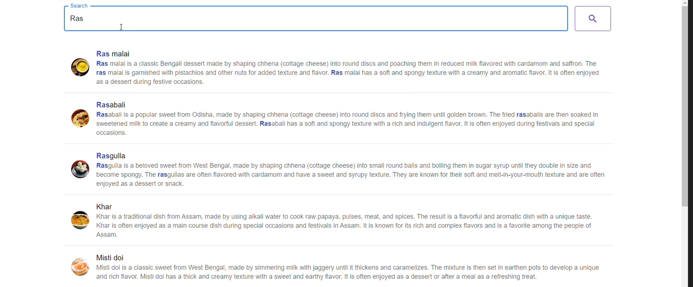
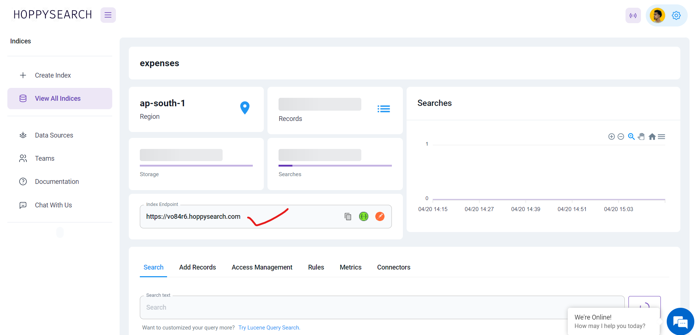
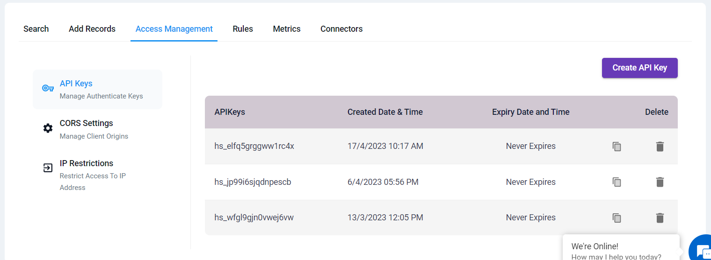

# Angular Connector

hoppysearch - AngularJS client for hoppysearch

Experience the power of the HoppySearch Angular Connector/Plugin in your project. Effortlessly integrate search functionality within minutes, enhancing user experience with a beautifully designed search page or autocomplete feature. Streamline your Angular application with this versatile tool. Explore seamless incorporation of a fully developed search interface.



## Installation

This project was generated with [Angular CLI](https://angular.io/cli) version 15.2.7.

### For [Angular.js](https://angular.io/cli)

#### npm

Proceed with the installation by following these steps:

```shell
npm install hs-searchpage-angular --save
```

## Getting Started

Please follow the [installation](#installation) instructions and execute the following AngularJS code:

#### Begin with the initial setup process:

1. Run the following command to install the Angular CLI globally:

#### cmd

```javascript
npm install -g @angular/cli
```

2. Create a new Angular application using the following command:

#### cmd

```javascript
ng new hs-searchpage
```

3. Navigate to Your Project Directory

### cmd

```javascript
cd hs-searchpage
```

4. Install the HoppySearch Angular Connector/Plugin

### cmd

```javascript
npm install hs-searchpage-angular
```

5.  Import the Connector/Plugin

    1. Open the src/app/app.module.ts file.

    2. Import the HsSearchpageAngularModule as shown below:

    ### TypeScript

    ```javascript
    import { HsSearchpageAngularModule } from "hs-searchpage-angular";
    ```

    3. Add HsSearchpageAngularModule to the imports array:

    ### TypeScript

    ```javascript
    @NgModule({
    ...
    imports: [
     ...
     HsSearchpageAngularModule
    ]
    })
    ```

6.  Add Material and Axios

    1. Integrate Angular Material into your project with the following command:

    ### cmd

    ```javascript
    ng add @angular/material
    ```

    2. Install Axios using npm:

    ### cmd

    ```javascript
    npm install axios
    ```

7.  Configure Your Component

    1. Open the src/app/app.component.ts file.

    2. Add the following properties to your component:

        ### TypeScript

     ```javascript
        props = {
        indexId: "YOUR INDEX ID",
        apiKey: "YOUR READ/WRITE API KEY",
        primaryText: "",
        secondaryText: "",
        targetURL: "",
        iconURL: "",
        onTypeSearch: true

    };
    ```

    3. Customize these properties with your specific values. Refer Configuration Details to get idea of props.

8. Update the HTML Template

    1. Open the src/app/app.component.html file.

    2. Replace the default code with the following:

    ### HTML

    ```javascript
    <lib-hs-searchpage-angular hoppySearchConfig="props"></lib-hs-searchpage-angular>
    ```

Now, your Angular project is equipped with the HoppySearch Angular Connector/Plugin. You'll have a fully developed search page or autocomplete feature based on your configuration.

## Configuration Details

Here's where to find the required information for configuration:

* Visit the Indices page and select the index where you want to apply the connector.

* **indexId**: Retrieve your index ID from your index endpoint. For example, if your index endpoint is (https://unm8df.hoppysearch.com) your index ID is "unm8df."



* apiKey: In the Access Management -> API Keys section, you'll find the necessary API key (choose an API key with write permission).



* **onTypeSearch**: Choose between "true" (automatic search as you type) or "false" (manual search by clicking the search button).

* **primaryText, secondaryText, targetURL, iconURL**:Customize these fields according to your dataset.

You can modify these configurations to suit your dataset and project requirements.

#### For a visual step-by-step guide on integrating the HoppySearch Angular Connector/Plugin into your Angular project, watch this [YouTube video.](https://youtu.be/kaDX-3NWU-k)

